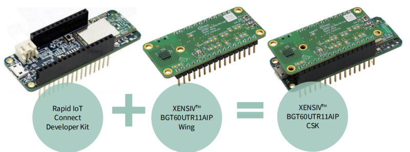
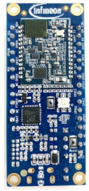
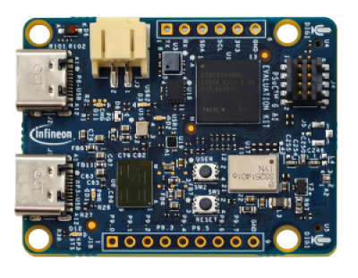
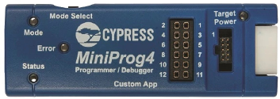
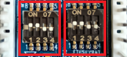
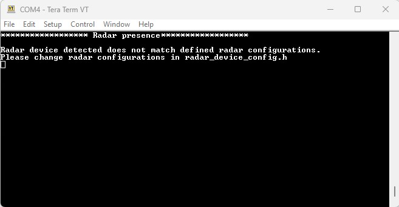
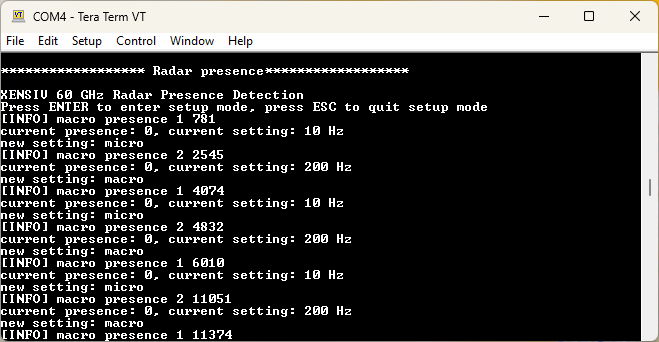
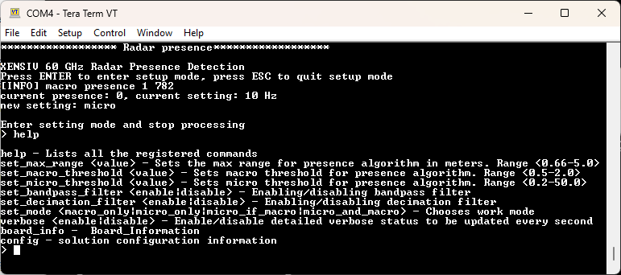
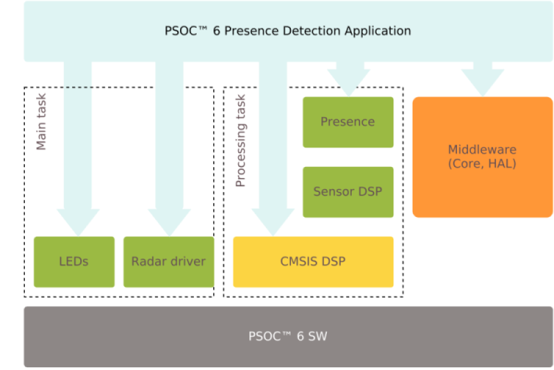

# PSOC&trade; 6 MCU: XENSIV&trade; 60 GHz radar presence detection

This code example demonstrates Infineon's radar presence detection sensor solution for human presence sensing within a configurable distance using the XENSIV&trade; [BGT60TR13C](https://www.infineon.com/cms/en/product/sensor/radar-sensors/radar-sensors-for-iot/60ghz-radar/bgt60tr13c) and [BGT60UTR11AIP](https://www.infineon.com/cms/en/product/sensor/radar-sensors/radar-sensors-for-iot/60ghz-radar/bgt60utr11aip) 60 GHz radar sensors. This solution provides extremely high accuracy in detecting both micro and macro motions, enabling efficient user interaction with devices.

The code example utilizes a special optimization mechanism to demonstrate the switching between different radar device configurations on the fly. Depending on the application use case, you can switch between two or more radar configurations. For example, you can switch from a radar device configured for presence detection to gesture control based on certain conditions within the user application (e.g., the range bin information of the detected target).

The code example demonstrates how the presence detection application can benefit from using power-saving features enabled through dynamic reconfiguration. The present example takes an advantage of the opportunity to save power by reconfiguring the radar sensor to slow down the frame rate. This is particularly beneficial, especially when running in the `MICRO_IF_MACRO` mode. This mechanism is detailed in the [Optimization mechanism](#optimization-mechanism) section.

[View this README on GitHub.](https://github.com/Infineon/mtb-example-ce241611-xensiv-60ghz-radar-presence-detection)

[Provide feedback on this code example.](https://cypress.co1.qualtrics.com/jfe/form/SV_1NTns53sK2yiljn?Q_EED=eyJVbmlxdWUgRG9jIElkIjoiQ0UyNDE2MTEiLCJTcGVjIE51bWJlciI6IjAwMi00MTYxMSIsIkRvYyBUaXRsZSI6IlBTT0MmdHJhZGU7IDYgTUNVOiBYRU5TSVYmdHJhZGU7IDYwIEdIeiByYWRhciBwcmVzZW5jZSBkZXRlY3Rpb24iLCJyaWQiOiJ1c21hbm11aCIsIkRvYyB2ZXJzaW9uIjoiMS4wLjAiLCJEb2MgTGFuZ3VhZ2UiOiJFbmdsaXNoIiwiRG9jIERpdmlzaW9uIjoiTUNEIiwiRG9jIEJVIjoiU0JTWVMiLCJEb2MgRmFtaWx5IjoiUFNPQyJ9)


## Requirements

- [ModusToolbox&trade;](https://www.infineon.com/modustoolbox) v3.4 
- Board support package (BSP) minimum required version: 4.0.0
- Programming language: C
- Associated parts: All [PSOC&trade; 6 MCU](https://www.infineon.com/cms/en/product/microcontroller/32-bit-psoc-arm-cortex-microcontroller/psoc-6-32-bit-arm-cortex-m4-mcu) parts


## Supported toolchains (make variable 'TOOLCHAIN')

- GNU Arm&reg; Embedded Compiler v10.3.1 (`GCC_ARM`) – Default value of `TOOLCHAIN`
- Arm&reg; Compiler v6.22 (`ARM`)
- IAR C/C++ Compiler v9.50.2 (`IAR`)


## Supported kits (make variable 'TARGET')

- [Rapid IoT Connect Developer Kit](https://github.com/Infineon/TARGET_CYSBSYSKIT-DEV-01) (`CYSBSYSKIT-DEV-01`) – Default value of `TARGET`
- [XENSIV&trade; BGT60TR13C Embedded Kit](https://github.com/Infineon/TARGET_KIT-BGT60TR13C-EMBEDD) (`KIT-BGT60TR13C-EMBEDD`)
- [PSOC&trade; 6 AI Evaluation Kit](https://www.infineon.com/CY8CKIT-062S2-AI) (`CY8CKIT-062S2-AI`)


## Hardware setup

### XENSIV&trade; BGT60TR13C Connected Sensor Kit

The XENSIV&trade; [KIT_CSK_BGT60TR13C](https://www.infineon.com/cms/en/product/evaluation-boards/kit_csk_bgt60tr13c/) is a comprehensive development kit consisting of:
- Rapid IoT Connect Developer Kit `CYSBSYSKIT-DEV-01`
- XENSIV&trade; BGT60TR13C Radar Wing `EVAL_BGT60TR13C_WING`

   **Figure 1. XENSIV&trade; BGT60TR13C CSK**

   

   <br>

To set up the kit, follow these steps:

1. Ensure that `EVAL_BGT60TR13C_WING` is mounted on the top of the `CYSBSYSKIT-DEV-01` kit through the pin headers

2. Connect the `CYSBSYSKIT-DEV-01` to your PC using the provided Micro USB cable through the KitProg3 USB connector
 
3. For optimal performance of the presence detection application, place the `KIT_CSK_BGT60TR13C` kit at a fixed location, such as the corner of a room


### XENSIV&trade; BGT60UTR11AIP Connected Sensor Kit

The XENSIV&trade; [KIT_CSK_BGT60UTR11AIP](https://www.infineon.com/cms/en/product/evaluation-boards/kit_csk_bgt60utr11aip/) is a comprehensive development kit consisting of:
- Rapid IoT Connect Developer Kit `CYSBSYSKIT-DEV-01`
- XENSIV&trade; BGT60UTR11AIP Radar Wing `EVAL_60UTR11AIP_WING`

   **Figure 2. XENSIV&trade; BGT60UTR11AIP CSK**

   

   <br>

To set up the kit, follow these steps:

1. Ensure that `EVAL_60UTR11AIP_WING` is mounted on the top of the `CYSBSYSKIT-DEV-01` kit through the pin headers

2. Connect the `CYSBSYSKIT-DEV-01` to your PC using the provided Micro USB cable through the KitProg3 USB connector
 
3. For optimal performance of the presence detection application, place the `KIT_CSK_BGT60UTR11AIP` kit at a fixed location, such as the corner of a room


### XENSIV&trade; BGT60TR13C Embedded Kit

**Figure 3. KIT-BGT60TR13C-EMBEDD kit**


   
<br>
   
1. Connect the `KIT-BGT60TR13C-EMBEDD` kit to your PC using the provided Micro USB cable through the KitProg3 USB connector

2. For optimal performance of the presence detection application, place the `KIT-BGT60TR13C-EMBEDD` kit at a fixed location, such as the corner of a room


### PSOC&trade; 6 AI Evaluation Kit

   **Figure 4. CY8CKIT-062S2-AI kit**

   
   
   <br>

1. Connect the `CY8CKIT-062S2-AI` to your PC using the provided Micro USB cable through the KitProg3 USB connector

2. For optimal performance of the presence detection application, place the `CY8CKIT-062S2-AI` kit at a fixed location, such as the corner of a room


## Software setup

See the [ModusToolbox&trade; tools package installation guide](https://www.infineon.com/ModusToolboxInstallguide) for information about installing and configuring the tools package.

Install a terminal emulator if you do not have one. Instructions in this document use [Tera Term](https://teratermproject.github.io/index-en.html).

This example requires no additional software or tools.


## Using the code example


### Create the project

The ModusToolbox&trade; tools package provides the Project Creator as both a GUI tool and a command line tool.

<details><summary><b>Use Project Creator GUI</b></summary>

1. Open the Project Creator GUI tool

   There are several ways to do this, including launching it from the dashboard or from inside the Eclipse IDE. For more details, see the [Project Creator user guide](https://www.infineon.com/ModusToolboxProjectCreator) (locally available at *{ModusToolbox&trade; install directory}/tools_{version}/project-creator/docs/project-creator.pdf*)

2. On the **Choose Board Support Package (BSP)** page, select a kit supported by this code example. See [Supported kits](#supported-kits-make-variable-target)

   > **Note:** To use this code example for a kit not listed here, you may need to update the source files. If the kit does not have the required resources, the application may not work

3. On the **Select Application** page:

   a. Select the **Applications(s) Root Path** and the **Target IDE**

      > **Note:** Depending on how you open the Project Creator tool, these fields may be pre-selected for you

   b. Select this code example from the list by enabling its check box

      > **Note:** You can narrow the list of displayed examples by typing in the filter box

   c. (Optional) Change the suggested **New Application Name** and **New BSP Name**

   d. Click **Create** to complete the application creation process

</details>


<details><summary><b>Use Project Creator CLI</b></summary>

The 'project-creator-cli' tool can be used to create applications from a CLI terminal or from within batch files or shell scripts. This tool is available in the *{ModusToolbox&trade; install directory}/tools_{version}/project-creator/* directory.

Use a CLI terminal to invoke the 'project-creator-cli' tool. On Windows, use the command-line 'modus-shell' program provided in the ModusToolbox&trade; installation instead of a standard Windows command-line application. This shell provides access to all ModusToolbox&trade; tools. You can access it by typing "modus-shell" in the search box in the Windows menu. In Linux and macOS, you can use any terminal application.

The following example clones the "[Human presence detection](https://github.com/Infineon/mtb-example-ce241611-xensiv-60ghz-radar-presence-detection)" application with the desired name "HumanPresenceDetection" configured for the *CYSBSYSKIT-DEV-01* BSP into the specified working directory, *C:/mtb_projects*:

   ```
   project-creator-cli --board-id CYSBSYSKIT-DEV-01 --app-id mtb-example-ce241611-xensiv-60ghz-radar-presence-detection --user-app-name HumanPresenceDetection --target-dir "C:/mtb_projects"
   ```

The 'project-creator-cli' tool has the following arguments:

Argument | Description | Required/optional
---------|-------------|-----------
`--board-id` | Defined in the <id> field of the [BSP](https://github.com/Infineon?q=bsp-manifest&type=&language=&sort=) manifest | Required
`--app-id`   | Defined in the <id> field of the [CE](https://github.com/Infineon?q=ce-manifest&type=&language=&sort=) manifest | Required
`--target-dir`| Specify the directory in which the application is to be created if you prefer not to use the default current working directory | Optional
`--user-app-name`| Specify the name of the application if you prefer to have a name other than the example's default name | Optional

<br>

> **Note:** The project-creator-cli tool uses the `git clone` and `make getlibs` commands to fetch the repository and import the required libraries. For details, see the "Project creator tools" section of the [ModusToolbox&trade; tools package user guide](https://www.infineon.com/ModusToolboxUserGuide) (locally available at {ModusToolbox&trade; install directory}/docs_{version}/mtb_user_guide.pdf).

</details>


### Open the project

After the project has been created, you can open it in your preferred development environment.


<details><summary><b>Eclipse IDE</b></summary>

If you opened the Project Creator tool from the included Eclipse IDE, the project will open in Eclipse automatically.

For more details, see the [Eclipse IDE for ModusToolbox&trade; user guide](https://www.infineon.com/MTBEclipseIDEUserGuide) (locally available at *{ModusToolbox&trade; install directory}/docs_{version}/mt_ide_user_guide.pdf*).

</details>


<details><summary><b>Visual Studio (VS) Code</b></summary>

Launch VS Code manually, and then open the generated *{project-name}.code-workspace* file located in the project directory.

For more details, see the [Visual Studio Code for ModusToolbox&trade; user guide](https://www.infineon.com/MTBVSCodeUserGuide) (locally available at *{ModusToolbox&trade; install directory}/docs_{version}/mt_vscode_user_guide.pdf*).

</details>


<details><summary><b>Arm&reg; Keil&reg; µVision&reg;</b></summary>

Double-click the generated *{project-name}.cprj* file to launch the Keil&reg; µVision&reg; IDE.

For more details, see the [Arm&reg; Keil&reg; µVision&reg; for ModusToolbox&trade; user guide](https://www.infineon.com/MTBuVisionUserGuide) (locally available at *{ModusToolbox&trade; install directory}/docs_{version}/mt_uvision_user_guide.pdf*).

</details>


<details><summary><b>IAR Embedded Workbench</b></summary>

Open IAR Embedded Workbench manually, and create a new project. Then select the generated *{project-name}.ipcf* file located in the project directory.

For more details, see the [IAR Embedded Workbench for ModusToolbox&trade; user guide](https://www.infineon.com/MTBIARUserGuide) (locally available at *{ModusToolbox&trade; install directory}/docs_{version}/mt_iar_user_guide.pdf*).

</details>


<details><summary><b>Command line</b></summary>

If you prefer to use the CLI, open the appropriate terminal, and navigate to the project directory. On Windows, use the command-line 'modus-shell' program; on Linux and macOS, you can use any terminal application. From there, you can run various `make` commands.

For more details, see the [ModusToolbox&trade; tools package user guide](https://www.infineon.com/ModusToolboxUserGuide) (locally available at *{ModusToolbox&trade; install directory}/docs_{version}/mtb_user_guide.pdf*).

</details>


## Operation

### XENSIV&trade; BGT60TR13C Connected Sensor Kit

1. Open a terminal program and select the KitProg3 COM port. Set the serial port parameters to 8N1 and 115200 baud

2. Program the board using one of the following:

   <details><summary><b>Using Eclipse IDE</b></summary>

      1. Select the application project in the Project Explorer

      2. In the **Quick Panel**, scroll down, and click **\<Application Name> Program (KitProg3_MiniProg4)**
      
   </details>

   <details><summary><b>In other IDEs</b></summary>

   Follow the instructions in your preferred IDE.
   
   </details>

   <details><summary><b>Using CLI</b></summary>

     From the terminal, execute the `make program` command to build and program the application using the default toolchain to the default target. The default toolchain is specified in the application's Makefile but you can override this value manually:
      ```
      make program TARGET=<BSP> TOOLCHAIN=<toolchain>
      ```
      Example:
      ```
      make program TARGET=CYSBSYSKIT-DEV-01 TOOLCHAIN=GCC_ARM
      ```
   </details>


### XENSIV&trade; BGT60UTR11AIP Connected Sensor Kit

1. Open **radar_device_config.h** file

2. Edit the definition of the `CONNECTED_RADAR_DEVICE` macro from `DEVICE_BGT60TR13C` to `DEVICE_BGT60UTR11`

3. Save the file and close

4. Open a terminal program and select the KitProg3 COM port. Set the serial port parameters to 8N1 and 115200 baud

5. Program the board using one of the following:

   <details><summary><b>Using Eclipse IDE</b></summary>

      1. Select the application project in the Project Explorer

      2. In the **Quick Panel**, scroll down, and click **\<Application Name> Program (KitProg3_MiniProg4)**
   
   </details>


   <details><summary><b>In other IDEs</b></summary>

   Follow the instructions in your preferred IDE.
   
   </details>


   <details><summary><b>Using CLI</b></summary>

     From the terminal, execute the `make program` command to build and program the application using the default toolchain to the default target. The default toolchain is specified in the application's Makefile but you can override this value manually:
      ```
      make program TARGET=<BSP> TOOLCHAIN=<toolchain>
      ```

      Example:
      ```
      make program TARGET=CYSBSYSKIT-DEV-01 TOOLCHAIN=GCC_ARM
      ```
   </details>


### XENSIV&trade; BGT60TR13C Embedded Kit

The KIT-BGT60TR13C-EMBEDD kit requires an external programmer, such as MiniProg4 that uses the SWD interface. 

**Figure 5. MiniProg4**




1. Set the proper jumpers on switches S3 and S5 by closing pins 1 and 2, and opening pins 3 and 4

   **Figure 6. Switch 3 and 5 position**

   

2. Connect the KIT-BGT60TR13C-EMBEDD kit SWD interface with the programmer. Then, plug the USB cables for the board and for the programmer to power on both

3. Open a terminal program and select a COM port where the board is connected (not the MiniProg4 port). Set the serial port parameters to 8N1 and 115200 baud

4. Program the board using one of the following:

   <details><summary><b>Using Eclipse IDE</b></summary>

   1. Select the application project in the Project Explorer

   2. In the **Quick Panel**, scroll down, and click **\<Application Name> Program (KitProg3_MiniProg4)**
   
   </details>

   <details><summary><b>Using CLI</b></summary>

   From the terminal, execute:

   ```
   make program TARGET=KIT-BGT60TR13C-EMBEDD TOOLCHAIN=GCC_ARM
   ```
   </details>


### PSOC&trade; 6 AI Evaluation Kit

1. Open a terminal program and select the KitProg3 COM port. Set the serial port parameters to 8N1 and 115200 baud

2. Program the board using one of the following:

   <details><summary><b>Using Eclipse IDE</b></summary>

      1. Select the application project in the Project Explorer

      2. In the **Quick Panel**, scroll down, and click **\<Application Name> Program (KitProg3_MiniProg4)**
      
   </details>

   <details><summary><b>In other IDEs</b></summary>

   Follow the instructions in your preferred IDE.
   
   </details>

   <details><summary><b>Using CLI</b></summary>

     From the terminal, execute the `make program` command to build and program the application using the default toolchain to the default target. The default toolchain is specified in the application's Makefile but you can override this value manually:
      ```
      make program TARGET=<BSP> TOOLCHAIN=<toolchain>
      ```
      Example:
      ```
      make program TARGET=CY8CKIT-062S2-AI TOOLCHAIN=GCC_ARM
      ```
   </details>


### Successful programming

Upon successful programming, the application starts automatically and displays the confirmation message "XENSIV 60 GHz Radar Presence Detection" on the UART terminal.

Ensure that the kit LED blinks at approximately 1 Hz.

   <details><summary><b>Error message</b></summary>

   If the mounted radar wing board does not match the enabled radar device configurations, an error message will be displayed on the UART terminal, indicating a configuration mismatch.

   **Figure 7. Terminal output wrong configurations**

   

   1. Open *radar_device_config.h* file

   2. Edit the definition of the `CONNECTED_RADAR_DEVICE` macro for the mounted radar device

   3. Save the file and close

   4. Reprogram the board
   
   </details>


### Terminal outputs

   The information that is printed out is in the following format:<br>
   [INFO] *Radar state* *Range bin* *Time stamp*<br>
   *Current presence state*, *Current radar setting*, *New radar setting*

   **Figure 8. Terminal output choosing different configurations**

   

   <br>

   **Table 1. Terminal outputs**

   Parameters  | Event type  | Description
   ----------- | ----------- | ----- 
   Radar state | Macro presence  | Presence event detected
   Range bin  | 2 | Maximum range bin
   Time stamp | '4298' | Relative time in ms
   Current presence state | 0 | 0: Macro <br> 1: Micro <br> 2: Absence
   Current radar setting | 10 Hz | 10 Hz: Low frame rate <br> 200 Hz: High frame rate
   New radar setting | macro/micro | Depends on the detection
   
   <br>

   > **Note:** *Time Stamp* is relative to the boot time, which means that when the application boots up first, the time counting starts from 0 ms.

   Conversion of range bin to range in meters can be done by using the following relation:

   ```
   R (range in meters) = (xensiv_radar_presence_get_bin_length() * config.max_range_bin)
   ```

   For example: If `xensiv_radar_presence_get_bin_length()` = 0.325, **R = 0.325 * 2 = 0.66 m**


### Sensor information and LEDs


#### XENSIV&trade; BGT60TR13C Connected Sensor Kit

For the KIT_CSK_BGT60TR13C kit, the radar task is suspended if the radar wing board is not connected to the feather kit. The sensor initialization process is indicated by blinking the red LED (CYBSP_USER_LED). The red LED (CYBSP_USER_LED) on the CYSBSYSKIT-DEV-01 kit blinks when the system is operational (ready state).

The LED on the KIT_CSK_BGT60TR13C kit uses the following color codes to indicate different events:

  **Table 2. Events and LED indication KIT_CSK_BGT60TR13C**

   LED color  | Event type  | Description
   ----------- | ----------- | ----- 
   Red  | `XENSIV_RADAR_PRESENCE_STATE_MACRO_PRESENCE` | Presence event detected
   Red  | `XENSIV_RADAR_PRESENCE_STATE_MICRO_PRESENCE` | Presence event detected
   Green  | `XENSIV_RADAR_PRESENCE_STATE_ABSENCE ` | Absence event detected
   
   <br>


#### XENSIV&trade; BGT60UTR11AIP Connected Sensor Kit

For the KIT_CSK_BGT60UTR11AIP kit, the radar task is suspended if the radar wing board is not connected to the feather kit. The sensor initialization process is indicated by blinking the red LED (CYBSP_USER_LED). The red LED (CYBSP_USER_LED) on the CYSBSYSKIT-DEV-01 kit blinks when the system is operational (ready state).

The LED on the KIT_CSK_BGT60UTR11AIP kit uses the following color codes to indicate different events:

  **Table 3. Events and LED indication KIT_CSK_BGT60UTR11AIP**

   LED color  | Event type  | Description
   ----------- | ----------- | ----- 
   Red  | `XENSIV_RADAR_PRESENCE_STATE_MACRO_PRESENCE` | Presence event detected
   Red  | `XENSIV_RADAR_PRESENCE_STATE_MICRO_PRESENCE` | Presence event detected
   Green  | `XENSIV_RADAR_PRESENCE_STATE_ABSENCE ` | Absence event detected
   
   <br>


#### XENSIV&trade; BGT60TR13C Embedded Kit

There is no user LED for the KIT-BGT60TR13C-EMBEDD kit to indicate the sensor initialization or operational process.

The LED indicates different events with different colors as follows:

   **Table 4. Events and LED indication for KIT-BGT60TR13C-EMBEDD**

   LED color  | Event type  | Description
   ----------- | ----------- | ----- 
   Red  | `XENSIV_RADAR_PRESENCE_STATE_MACRO_PRESENCE` | Presence event detected
   Red  | `XENSIV_RADAR_PRESENCE_STATE_MICRO_PRESENCE` | Presence event detected
   Green  | `XENSIV_RADAR_PRESENCE_STATE_ABSENCE ` | Absence event detected
   
   <br>


#### PSOC&trade; 6 AI Evaluation Kit

The CY8CKIT-062S2-AI kit features LEDs that indicate different events through a color-coded system. The LEDs and their corresponding events are:

   **Table 5. Events and LED indication for CY8CKIT-062S2-AI kit**

   LED color  | Event type  | Description
   ----------- | ----------- | -----
   Red (LED1)  | `XENSIV_RADAR_PRESENCE_STATE_MACRO_PRESENCE` | Presence event detected
   Red (LED1)  | `XENSIV_RADAR_PRESENCE_STATE_MICRO_PRESENCE` | Presence event detected
   Red (LED2)  | `XENSIV_RADAR_PRESENCE_STATE_ABSENCE ` | Absence event detected
   
   <br>


### Configuration parameters

You can configure the application parameters using the options provided on the terminal as follows:

1. Press **Enter** to switch from work to settings mode

2. Type help and press **Enter** to see a list of configurable parameters as shown in **Figure 9**

   **Figure 9. Configuration mode**

   

   The following table lists the configurable parameters with valid values:

   **Table 6. Presence detection algorithm configuration parameters**

   Key | Default value  | Valid values
   ----------- | ----------- | -----
   set_max_range (m)| 2.0 | 0.66 – 5.0
   set_macro_threshold | 0.5 | 0.5 – 2.0
   set_micro_threshold | 12.5 | 0.2 – 50.0
   set_bandpass_filter | disable | enable/disable
   set_decimation_filter | disable | enable/disable
   set_mode | micro_if_macro | macro_only/micro_only/micro_if_macro/micro_and_macro

   <br>

   Note the following:

   - **Micro motions:** Detecting small movements such as finger gestures or small head movements in a typical smart home environment. These include working on a laptop or keyboard, or normal breathing, and blinking of the eyes in sitting or standing positions (in line of sight)

   - **Macro motions:** Detecting major movements into or through the field of view (motion detection)

   > **Note:** Macro and micro threshold parameters can be adjusted to achieve different levels of sensitivity. The following table summarizes three different levels. For example, high sensitivity means that the solution is more sensitive to smaller movements. You can set any threshold values based on your use case requirement

   **Table 7. Sensitivity levels with corresponding threshold setting**

   Sensitivity|Macro threshold value |Micro threshold value
   ----------- | ----------- | -----
   High| 0.5 | 12.5
   Medium | 1.0 | 25
   Low | 2.0 | 50

   <br>

3. Type the command name with the required value and press **Enter**

   If the parameter update is successful, "ok" is displayed; otherwise "command not recognized" or "invalid value" is printed

For details, see the [XENSIV&trade; Radar Presence API Reference Guide](https://infineon.github.io/xensiv-radar-presence/html/index.html).


## Debugging

You can debug the example to step through the code.


<details><summary><b>In Eclipse IDE</b></summary>

Use the **\<Application Name> Debug (KitProg3_MiniProg4)** configuration in the **Quick Panel**. For details, see the "Program and debug" section in the [Eclipse IDE for ModusToolbox&trade; user guide](https://www.infineon.com/MTBEclipseIDEUserGuide).

> **Note:** **(Only while debugging)** On the CM4 CPU, some code in `main()` may execute before the debugger halts at the beginning of `main()`. This means that some code executes twice – once before the debugger stops execution, and again after the debugger resets the program counter to the beginning of `main()`. See [PSOC&trade; 6 MCU: Code in main() executes before the debugger halts at the first line of main()](https://community.infineon.com/docs/DOC-21143) to learn about this and for the workaround.

</details>


<details><summary><b>In other IDEs</b></summary>

Follow the instructions in your preferred IDE.

</details>


## Design and implementation


### Resources and settings

This application uses a modular approach to build a presence application combining a radar driver and presence algorithm library and the following components:

**Figure 10. Application overview**



The radar configuration parameters are generated from a PC tool and saved in *radar_settings.h* file. For more details, see the [XENSIV&trade; BGT60TRxx Radar API Reference Guide](https://infineon.github.io/sensor-xensiv-bgt60trxx/html/index.html).

After initialization, the application runs in an event-driven way. The radar interrupt is used to notify the MCU, which retrieves the raw data into a software buffer and then triggers the main task to normalize and feed the data to the presence library.

**Figure 11. Application execution**


### Optimization mechanism

This code example uses a special optimization mechanism to demonstrate the switching between different radar device configurations:

- Low frame rate is sufficient for macro movement detection

- High frame rate is required for micro movement detection

Therefore, in the default presence detection mode of `MICRO_IF_MACRO`, the radar device can be configured with a low frame rate by default and only reconfigured with a high frame rate configuration when it is expected to perform micro detection. By implementing such a mechanism, the application benefits from **some power-savings**.

In the processing task, the optimization object is initialized with the reconfiguration function pointer. The application then runs the presence algorithm normally. The evaluation for the reconfiguration of the radar device is performed in two cases:

- The application receives a request to change the presence detection mode (e.g., from `MACRO_ONLY` to `MICRO_IF_MACRO`)

- A change in the presence detection state occurs (e.g., from absence to macro detected)

The radar device reconfiguration involves rewriting the radar registers with a new set of values, reconfiguring the radar FIFO limit, and restarting the radar frame

**Figure 12. Radar activity**


### Configuration logic

The following configuration logic (see **Figure 12**) is deployed in the evaluation process when the application is operating in `MICRO_IF_MACRO` mode.

- If the radar is currently configured with a low frame rate and has detected a macro presence, it can detect a micro presence. Therefore, the radar needs to be reconfigured with a high frame rate

- If the radar is currently configured with a high frame rate and has detected a macro presence instead of a micro presence, the radar can be reconfigured with the low frame rate to save power

- If the radar is currently configured with a high frame rate and there is no presence detected (absence), the radar can be reconfigured with a low frame rate to detect a macro presence

**Table 8. Switching to MICRO_IF_MACRO mode**

Radar current state |Last detected state |Radar new mode
----------- | ----------- | -----
Low frame rate | MACRO | High frame rate
High frame rate | MACRO| High frame rate
High frame rate  | ABSENCE | Low Frame rate

<br>


### Adding different configurations

Each radar configuration is a structure containing a pointer to a register list, the number of registers, and the FIFO limit. To use a radar configuration suitable for your application, perform these steps:

- In *optimization_list.h* file, edit or add to the existing configurations (i.e., `optimizations_list[]` and `optimization_type_e`) in the code example.

- Provide the new configuration register list per the example given in *radar_high_framerate_config.h* and *radar_low_framerate_config.h* files. You can use the [XENSIV&trade; BGT60TRxx Radar Sensor](https://github.com/Infineon/sensor-xensiv-bgt60trxx) to generate the register list.


```c
typedef struct {
    uint32_t *reg_list;
    uint8_t reg_list_size;
    uint32_t fifo_limit;
} optimization_s;
```

```c
optimization_s optimizations_list[] = {
    {
        register_list_macro_only,
        XENSIV_BGT60TRXX_CONF_NUM_REGS_MACRO,
        NUM_SAMPLES_PER_FRAME * 2
    },
    {
        register_list_micro_only,
        XENSIV_BGT60TRXX_CONF_NUM_REGS_MICRO,
        NUM_SAMPLES_PER_FRAME * 2
    },
    {
        register_list_user_config,
        XENSIV_BGT60TRXX_CONF_NUM_REGS_USER_CONFIG,
        NUM_SAMPLES_PER_FRAME * 2
    }
};
```

```c
typedef enum {
    CONFIG_LOW_FRAME_RATE_OPT,
    CONFIG_HIGH_FRAME_RATE_OPT,
    CONFIG_USER_CONFIG_OPT,
    CONFIG_UNINITIALIZED = 64
} optimization_type_e;
```


## Optimizer API

**Table 9. API functions**

API function | Description
-------------|------------
`radar_config_optimizer_init` | Initializes optimization component. Requires a pointer to the radar reconfiguration function
`radar_config_optimizer_set_operational_mode` | Saves the new mode to which you want to switch. This function is called during mode selection in the CLI
`radar_config_optimize` | Switches to the new mode. The new list of registers is chosen and saved into the radar, depending on the selected mode and last presence event
`radar_config_get_current_optimization` | Returns the current chosen optimization mode: low or high frame rate

<br>

**Table 10. Application resources**

 Resource  |  Alias/object     |    Purpose
 :-------- | :-------------    | :------------
 UART (HAL) |cy_retarget_io_uart_obj | UART HAL object used by Retarget-IO for the Debug UART port
 SPI (HAL)    | spi     | SPI driver to communicate with radar sensor
 GPIO (HAL)    | CYBSP_USER_LED     | User LED
 GPIO (HAL)    | CYBSP_USER_LED_RED     | User LED
 GPIO (HAL)    | CYBSP_USER_LED_GREEN    | User LED
 GPIO (HAL)    | CYBSP_USER_LED_BLUE     | User LED

<br>


## Related resources

Resources  | Links
-----------|----------------------------------
Application notes  | [AN228571](https://www.infineon.com/AN228571) – Getting started with PSOC&trade; 6 MCU on ModusToolbox&trade; <br> [AN215656](https://www.infineon.com/AN215656) – PSOC&trade; 6 MCU dual-core system design <br>[AN124642](https://www.infineon.com/dgdl/Infineon-AN124642_Presence_detection_solution_using_XENSIV_KIT_CSK_BGT60TR13C_60_GHz_radar-ApplicationNotes-v01_00-EN.pdf?fileId=8ac78c8c901008d10190163a298b064b) – Presence detection solution using XENSIV&trade; KIT_CSK_BGT60TR13C 60 GHz radar
Code examples  | [Using ModusToolbox&trade;](https://github.com/Infineon/Code-Examples-for-ModusToolbox-Software) on GitHub
Device documentation | [PSOC&trade; 6 MCU datasheets](https://documentation.infineon.com/html/psoc6/bnm1651211483724.html) <br> [PSOC&trade; 6 technical reference manuals](https://documentation.infineon.com/html/psoc6/zrs1651212645947.html)
Development kits | Select your kits from the [Evaluation board finder](https://www.infineon.com/cms/en/design-support/finder-selection-tools/product-finder/evaluation-board).
Libraries on GitHub  | [sensor-xensiv-bgt60trxx](https://github.com/Infineon/sensor-xensiv-bgt60trxx) – Driver library to interface with the XENSIV&trade; BGT60TRxx 60 GHz FMCW radar sensors <br> [xensiv-radar-presence](https://github.com/Infineon/xensiv-radar-presence) – Presence library to detect human presence using XENSIV&trade; BGT60TR13C <br> [sensor-dsp](https://github.com/Infineon/sensor-dsp) – Sensor-DSP library to provide signal processing functions for sensor applications <br> [mtb-pdl-cat1](https://github.com/Infineon/mtb-pdl-cat1) – PSOC&trade; 6 Peripheral Driver Library (PDL) <br> [mtb-hal-cat1](https://github.com/Infineon/mtb-hal-cat1) – Hardware Abstraction Layer (HAL) library <br> [retarget-io](https://github.com/Infineon/retarget-io) – Utility library to retarget STDIO messages to a UART port
Middleware on GitHub  |  [psoc6-middleware](https://github.com/Infineon/modustoolbox-software#psoc-6-middleware-libraries) – Links to all PSOC&trade; 6 MCU middleware
Tools  | [ModusToolbox&trade;](https://www.infineon.com/modustoolbox) – ModusToolbox&trade; software is a collection of easy-to-use libraries and tools enabling rapid development with Infineon MCUs for applications ranging from wireless and cloud-connected systems, edge AI/ML, embedded sense and control, to wired USB connectivity using PSOC&trade; Industrial/IoT MCUs, AIROC&trade; Wi-Fi and Bluetooth&reg; connectivity devices, XMC&trade; Industrial MCUs, and EZ-USB&trade;/EZ-PD&trade; wired connectivity controllers. ModusToolbox&trade; incorporates a comprehensive set of BSPs, HAL, libraries, configuration tools, and provides support for industry-standard IDEs to fast-track your embedded application development.

<br>


## Other resources

Infineon provides a wealth of data at [www.infineon.com](https://www.infineon.com) to help you select the right device, and quickly and effectively integrate it into your design.

For more information about connected sensor kit, see [IoT sensor platform](https://www.infineon.com/connectedsensorkit).


## Document history

Document title: *CE241611* – *PSOC&trade; 6 MCU: XENSIV&trade; 60 GHz radar presence detection*

 Version | Description of change
 ------- | ---------------------
 1.0.0   | New code example
<br>


All referenced product or service names and trademarks are the property of their respective owners.

The Bluetooth&reg; word mark and logos are registered trademarks owned by Bluetooth SIG, Inc., and any use of such marks by Infineon is under license.

PSOC&trade;, formerly known as PSoC&trade;, is a trademark of Infineon Technologies. Any references to PSoC&trade; in this document or others shall be deemed to refer to PSOC&trade;.

---------------------------------------------------------

© Cypress Semiconductor Corporation, 2025. This document is the property of Cypress Semiconductor Corporation, an Infineon Technologies company, and its affiliates ("Cypress").  This document, including any software or firmware included or referenced in this document ("Software"), is owned by Cypress under the intellectual property laws and treaties of the United States and other countries worldwide.  Cypress reserves all rights under such laws and treaties and does not, except as specifically stated in this paragraph, grant any license under its patents, copyrights, trademarks, or other intellectual property rights.  If the Software is not accompanied by a license agreement and you do not otherwise have a written agreement with Cypress governing the use of the Software, then Cypress hereby grants you a personal, non-exclusive, nontransferable license (without the right to sublicense) (1) under its copyright rights in the Software (a) for Software provided in source code form, to modify and reproduce the Software solely for use with Cypress hardware products, only internally within your organization, and (b) to distribute the Software in binary code form externally to end users (either directly or indirectly through resellers and distributors), solely for use on Cypress hardware product units, and (2) under those claims of Cypress's patents that are infringed by the Software (as provided by Cypress, unmodified) to make, use, distribute, and import the Software solely for use with Cypress hardware products.  Any other use, reproduction, modification, translation, or compilation of the Software is prohibited.
<br>
TO THE EXTENT PERMITTED BY APPLICABLE LAW, CYPRESS MAKES NO WARRANTY OF ANY KIND, EXPRESS OR IMPLIED, WITH REGARD TO THIS DOCUMENT OR ANY SOFTWARE OR ACCOMPANYING HARDWARE, INCLUDING, BUT NOT LIMITED TO, THE IMPLIED WARRANTIES OF MERCHANTABILITY AND FITNESS FOR A PARTICULAR PURPOSE.  No computing device can be absolutely secure.  Therefore, despite security measures implemented in Cypress hardware or software products, Cypress shall have no liability arising out of any security breach, such as unauthorized access to or use of a Cypress product. CYPRESS DOES NOT REPRESENT, WARRANT, OR GUARANTEE THAT CYPRESS PRODUCTS, OR SYSTEMS CREATED USING CYPRESS PRODUCTS, WILL BE FREE FROM CORRUPTION, ATTACK, VIRUSES, INTERFERENCE, HACKING, DATA LOSS OR THEFT, OR OTHER SECURITY INTRUSION (collectively, "Security Breach").  Cypress disclaims any liability relating to any Security Breach, and you shall and hereby do release Cypress from any claim, damage, or other liability arising from any Security Breach.  In addition, the products described in these materials may contain design defects or errors known as errata which may cause the product to deviate from published specifications. To the extent permitted by applicable law, Cypress reserves the right to make changes to this document without further notice. Cypress does not assume any liability arising out of the application or use of any product or circuit described in this document. Any information provided in this document, including any sample design information or programming code, is provided only for reference purposes.  It is the responsibility of the user of this document to properly design, program, and test the functionality and safety of any application made of this information and any resulting product.  "High-Risk Device" means any device or system whose failure could cause personal injury, death, or property damage.  Examples of High-Risk Devices are weapons, nuclear installations, surgical implants, and other medical devices.  "Critical Component" means any component of a High-Risk Device whose failure to perform can be reasonably expected to cause, directly or indirectly, the failure of the High-Risk Device, or to affect its safety or effectiveness.  Cypress is not liable, in whole or in part, and you shall and hereby do release Cypress from any claim, damage, or other liability arising from any use of a Cypress product as a Critical Component in a High-Risk Device. You shall indemnify and hold Cypress, including its affiliates, and its directors, officers, employees, agents, distributors, and assigns harmless from and against all claims, costs, damages, and expenses, arising out of any claim, including claims for product liability, personal injury or death, or property damage arising from any use of a Cypress product as a Critical Component in a High-Risk Device. Cypress products are not intended or authorized for use as a Critical Component in any High-Risk Device except to the limited extent that (i) Cypress's published data sheet for the product explicitly states Cypress has qualified the product for use in a specific High-Risk Device, or (ii) Cypress has given you advance written authorization to use the product as a Critical Component in the specific High-Risk Device and you have signed a separate indemnification agreement.
<br>
Cypress, the Cypress logo, and combinations thereof, ModusToolbox, PSoC, CAPSENSE, EZ-USB, F-RAM, and TRAVEO are trademarks or registered trademarks of Cypress or a subsidiary of Cypress in the United States or in other countries. For a more complete list of Cypress trademarks, visit www.infineon.com. Other names and brands may be claimed as property of their respective owners.
